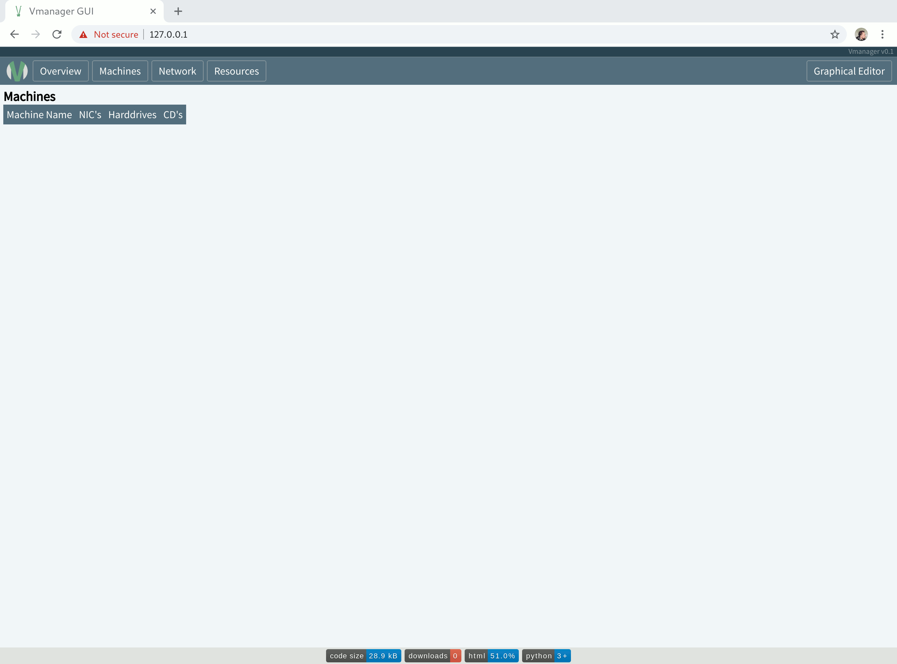

# VManager

A graphical front-end for [python-Vmanager](https://github.com/Torxed/Vmanager).



# Dependencies

 * [slimHTTP](https://github.com/Torxed/slimHTTP)
 * [spiderWeb](https://github.com/Torxed/spiderWeb)
 * [Vmanager](https://github.com/Torxed/Vmanager)

All these dependencies are located as submodules in `./dependencies`.<br>
They are all developed by myself and are essnetially just helper scripts<br>
to get a HTTPS server up and running with WebSocket support.

As well as the KVM wrapper `Vmanager` itself.

# Installation

```bash
$ git clone -recurse https://github.com/Torxed/Vmanager-gui.git
$ cd Vmanager-gui
$ sudo python main.py
```
